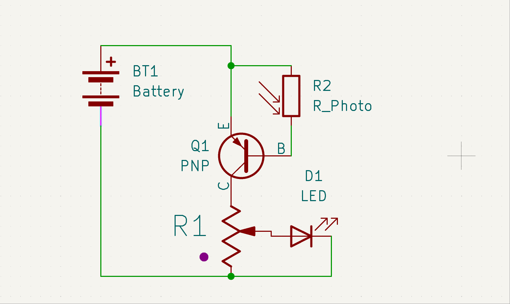
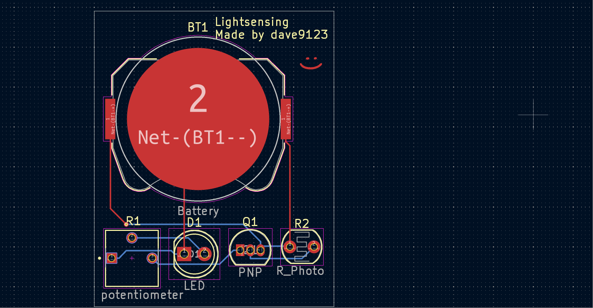
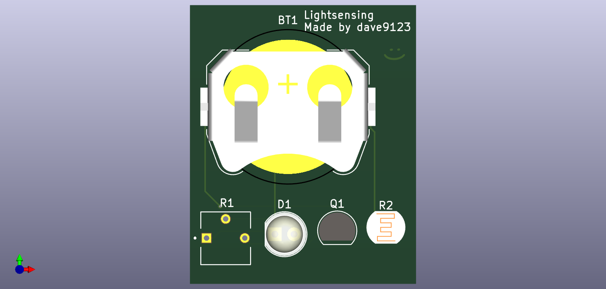

# Lightsensing
A board that turns an LED on if no light is detected. Gerbers can be found at [pcb/gerber_to_order](./pcb/gerber_to_order)

## Features
1. Customizable photoresistor resistance using a potentiometer
2. Small design

## BOM
1. 1x Keystone 3034 CR2032 Battery Holder
2. 1x GL5528 Photoresistor
3. 1x 3362P-1-103 Potentiometer
4. 1x 2N3906 PNP Transistor
5. 1x THT LED

| Schematics | PCB | 3D View |
| :-: | :-: | :-: |
|  |  |  |